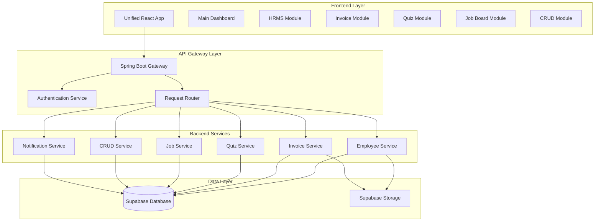

# Design Document - Unified ERP System

## Overview

The Unified ERP System integrates five existing standalone applications (Employee Management System, Invoice App, Quiz Application, Indeed Clone, and CRUD Application) into a comprehensive enterprise resource planning platform. The system will feature a modern, responsive UI built with React and Material-UI, a Spring Boot backend architecture with microservices approach, and Supabase integration for data persistence and authentication.

The design emphasizes minimal code duplication by creating shared components and services while maintaining the existing functionality of each module. The system will be containerized using Docker for scalable deployment and will extend the existing invoice app's .env configuration.

## Architecture

### High-Level Architecture



### Technology Stack Integration

- **Frontend**: Single React 18.2+ application with Material-UI components
- **Backend**: Spring Boot 3.1+ with Java 17, organized as microservices
- **Database**: Supabase PostgreSQL with existing configuration
- **Authentication**: Supabase Auth with role-based access control
- **Containerization**: Docker with docker-compose orchestration
- **File Storage**: Supabase Storage for documents and media

## Components and Interfaces

### Frontend Components

#### Core Layout Components
- **AppLayout**: Main application wrapper with navigation and header
- **NavigationSidebar**: Module switcher with role-based visibility
- **HeaderBar**: User profile, notifications, and global actions
- **ModuleContainer**: Wrapper for individual module content

#### Shared UI Components
- **DataTable**: Reusable table component for all modules
- **FormBuilder**: Dynamic form generation for CRUD operations
- **SearchFilter**: Universal search and filtering component
- **ReportViewer**: Integrated reporting component
- **NotificationCenter**: Real-time notifications across modules

#### Module-Specific Components
- **EmployeeDashboard**: HRMS overview with employee metrics
- **InvoiceWorkflow**: Enhanced invoice processing with approvals
- **QuizManager**: Training assignment and progress tracking
- **JobBoard**: Recruitment pipeline management
- **CrudInterface**: Generic data management interface

### Backend Services Architecture

#### API Gateway Service
```java
@RestController
@RequestMapping("/api")
public class ApiGatewayController {
    // Route requests to appropriate microservices
    // Handle authentication and authorization
    // Implement rate limiting and logging
}
```

#### Employee Service (Enhanced HRMS)
```java
@RestController
@RequestMapping("/api/employees")
public class EmployeeController {
    // Employee CRUD operations
    // Department and role management
    // Integration endpoints for other modules
}

@Entity
public class Employee {
    private Long id;
    private String firstName;
    private String lastName;
    private String email;
    private Department department;
    private Role role;
    private List<Permission> permissions;
    // Integration fields
    private List<Invoice> assignedInvoices;
    private List<QuizResult> trainingRecords;
    private List<JobApplication> applications;
}
```

#### Integration Service
```java
@Service
public class IntegrationService {
    // Cross-module data synchronization
    // Event-driven updates between services
    // Data consistency management
}
```

### Database Schema Design

#### Core Tables
- **employees**: Enhanced employee records with integration fields
- **departments**: Organizational structure
- **roles**: Role definitions with permissions
- **permissions**: Granular access control
- **user_sessions**: Authentication and session management

#### Integration Tables
- **employee_invoices**: Links employees to invoice processing
- **employee_training**: Training assignments and completion records
- **employee_applications**: Job application tracking
- **cross_module_events**: Event log for inter-module communication

#### Existing Table Extensions
- **invoices**: Add employee assignment and approval workflow fields
- **quizzes**: Add employee assignment and department targeting
- **job_postings**: Add hiring manager and department associations

## Data Models

### Enhanced Employee Model
```typescript
interface Employee {
  id: number;
  personalInfo: {
    firstName: string;
    lastName: string;
    email: string;
    phone: string;
    address: Address;
  };
  employment: {
    employeeId: string;
    department: Department;
    role: Role;
    manager: Employee;
    startDate: Date;
    status: EmployeeStatus;
  };
  permissions: Permission[];
  integrations: {
    assignedInvoices: Invoice[];
    trainingRecords: TrainingRecord[];
    jobApplications: JobApplication[];
  };
}
```

### Unified User Context
```typescript
interface UserContext {
  user: Employee;
  permissions: Permission[];
  activeModule: ModuleType;
  preferences: UserPreferences;
  notifications: Notification[];
}
```

### Cross-Module Event Model
```typescript
interface CrossModuleEvent {
  id: string;
  sourceModule: ModuleType;
  targetModule: ModuleType;
  eventType: EventType;
  payload: any;
  timestamp: Date;
  processed: boolean;
}
```

## Error Handling

### Frontend Error Handling
- **Global Error Boundary**: Catch and display user-friendly error messages
- **API Error Interceptor**: Centralized handling of HTTP errors
- **Validation Errors**: Real-time form validation with clear feedback
- **Network Error Recovery**: Automatic retry and offline mode support

### Backend Error Handling
- **Global Exception Handler**: Consistent error response format
- **Service-Level Validation**: Business rule validation with detailed messages
- **Database Error Mapping**: Convert database errors to user-friendly messages
- **Integration Error Handling**: Graceful degradation when modules are unavailable

### Error Response Format
```json
{
  "error": {
    "code": "VALIDATION_ERROR",
    "message": "Employee email already exists",
    "details": {
      "field": "email",
      "value": "john.doe@company.com"
    },
    "timestamp": "2025-01-09T10:30:00Z"
  }
}
```

## Testing Strategy

### Frontend Testing
- **Unit Tests**: Jest and React Testing Library for components
- **Integration Tests**: API integration testing with mock services
- **E2E Tests**: Cypress for critical user workflows
- **Visual Regression Tests**: Storybook with Chromatic for UI consistency

### Backend Testing
- **Unit Tests**: JUnit 5 for service and controller logic
- **Integration Tests**: Spring Boot Test with TestContainers for database
- **API Tests**: RestAssured for endpoint testing
- **Performance Tests**: JMeter for load testing critical endpoints

### Cross-Module Testing
- **Integration Flow Tests**: End-to-end workflows across modules
- **Data Consistency Tests**: Verify data synchronization between modules
- **Permission Tests**: Role-based access control validation
- **Event Processing Tests**: Cross-module event handling verification

### Test Data Management
- **Database Seeding**: Automated test data creation for all modules
- **Test Isolation**: Each test runs with clean, isolated data
- **Mock Services**: External service mocking for reliable testing
- **Performance Benchmarks**: Automated performance regression detection

## Security Considerations

### Authentication and Authorization
- **Supabase Auth Integration**: Leverage existing authentication system
- **JWT Token Management**: Secure token handling and refresh
- **Role-Based Access Control**: Granular permissions per module
- **Session Management**: Secure session handling across modules

### Data Protection
- **Input Validation**: Comprehensive validation on all inputs
- **SQL Injection Prevention**: Parameterized queries and ORM usage
- **XSS Protection**: Content Security Policy and input sanitization
- **CSRF Protection**: Token-based CSRF prevention

### API Security
- **Rate Limiting**: Prevent API abuse and DoS attacks
- **CORS Configuration**: Proper cross-origin resource sharing setup
- **API Versioning**: Maintain backward compatibility
- **Audit Logging**: Track all user actions and system events

## Performance Optimization

### Frontend Performance
- **Code Splitting**: Lazy loading of modules and components
- **Caching Strategy**: Browser caching and service worker implementation
- **Bundle Optimization**: Tree shaking and minification
- **Image Optimization**: Responsive images and lazy loading

### Backend Performance
- **Database Indexing**: Optimized indexes for common queries
- **Connection Pooling**: Efficient database connection management
- **Caching Layer**: Redis caching for frequently accessed data
- **Async Processing**: Background job processing for heavy operations

### Infrastructure Performance
- **Docker Optimization**: Multi-stage builds and layer caching
- **Load Balancing**: Horizontal scaling support
- **CDN Integration**: Static asset delivery optimization
- **Monitoring**: Application performance monitoring and alerting

## Deployment Architecture

### Docker Configuration
```yaml
# docker-compose.unified.yml
version: '3.8'
services:
  erp-gateway:
    build: ./gateway
    ports: ["8080:8080"]
    environment:
      - SUPABASE_URL=${SUPABASE_URL}
      - SUPABASE_ANON_KEY=${SUPABASE_ANON_KEY}
  
  erp-frontend:
    build: ./client
    ports: ["3000:3000"]
    environment:
      - REACT_APP_API_URL=http://localhost:8080
  
  employee-service:
    build: ./services/employee
    environment:
      - SUPABASE_DB_URL=${SUPABASE_DB_URL}
  
  invoice-service:
    build: ./services/invoice
    environment:
      - SUPABASE_DB_URL=${SUPABASE_DB_URL}
```

### Environment Configuration Extension
```bash
# Extended .env based on existing invoice-app/.env
# Supabase Configuration (existing)
SUPABASE_URL=https://cdqbymbzzurskfctyhqm.supabase.co
SUPABASE_ANON_KEY=eyJhbGciOiJIUzI1NiIsInR5cCI6IkpXVCJ9...

# New ERP Configuration
ERP_JWT_SECRET=your-jwt-secret-key
ERP_SESSION_TIMEOUT=3600
ERP_NOTIFICATION_EMAIL=admin@company.com

# Module Configuration
HRMS_ENABLED=true
INVOICE_ENABLED=true
QUIZ_ENABLED=true
JOBS_ENABLED=true
CRUD_ENABLED=true

# Integration Settings
CROSS_MODULE_EVENTS=true
REAL_TIME_NOTIFICATIONS=true
AUDIT_LOGGING=true
```

This design provides a comprehensive foundation for building the unified ERP system while leveraging existing infrastructure and minimizing code duplication. The modular architecture allows for incremental development and easy maintenance of individual components.